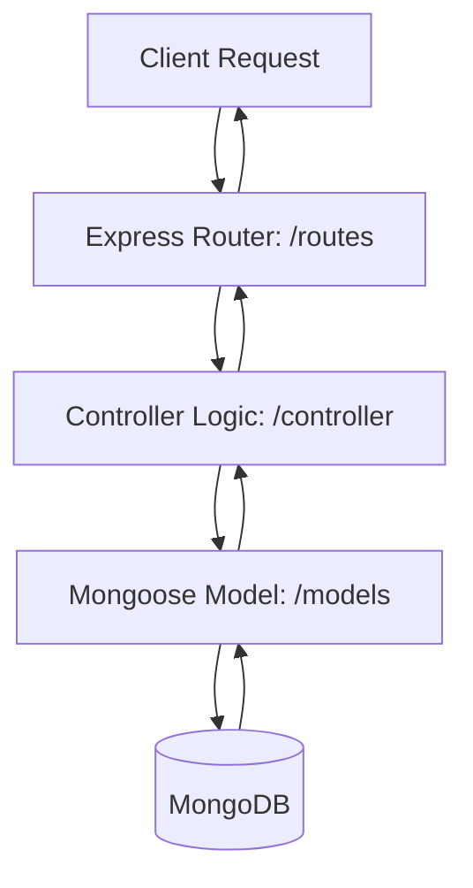
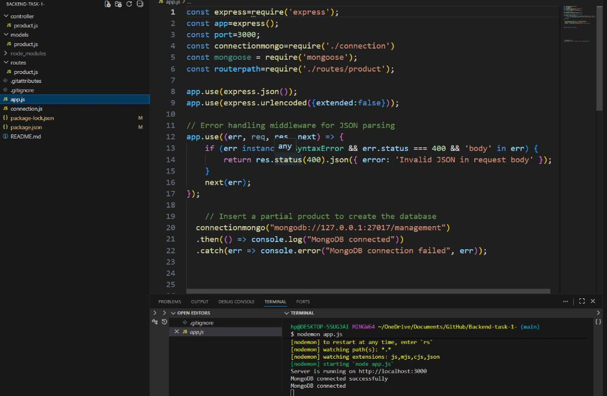

  <h1>SyntecxHub: Backend Task 1</h1>
  
<b>The Beginning of My Backend Development Journey</b>

  
  
  
  

---

## Overview

I am glad to share that I have successfully completed **Task 1** of my internship at SyntecxHub. This task focused on backend development, where I worked on building and understanding server-side logic, API handling, and database interactions. It was a great learning experience that helped me strengthen my fundamentals and gain practical exposure to real-world backend workflows.

This repository marks the beginning of my backend journey, implementing foundational Product Management endpoints.

---

## Workflow Architecture

The API follows a standard MVC-inspired architecture for separating routing, controller logic, and database schemas.

---

## Basic CRUD Operations

This project implements a complete CRUD (Create, Read, Update, Delete) system for a `Product` entity, along with advanced querying capabilities.

### 1. Create Product
* **Function:** `createProduct`
* **Details:** Receives product details (`name`, `price`, `description`, `category`) and inserts a new document into the MongoDB database.

### 2. Read Products
* **Function:** `getAllProducts` & `getById`
* **Details:** Fetches all products stored in the database, or retrieves a specific product using its unique MongoDB ID.

### 3. Update Product
* **Function:** `updateById`
* **Details:** Locates a specific product by its ID and applies partial updates based on the request body using `findByIdAndUpdate`.

### 4. Delete Product
* **Function:** `deleteproduct`
* **Details:** Permanently removes a product document from the database using its ID.

### Advanced Features
* **Pagination:** `pagination` - Uses `limit` and `skip` query parameters to return subsets of the product list.
* **Price Filtering:** `filterprice` - Filters products within a specific price range using MongoDB's `$gte` and `$lte` operators.

---

## Server Initialization

Here is a look at the server initialization and successful MongoDB connection running within the VS Code environment:

---

> *#SyntecxHub #BackendDevelopment #InternshipJourney #NodeJS #APIDevelopment #LearningExperience*
